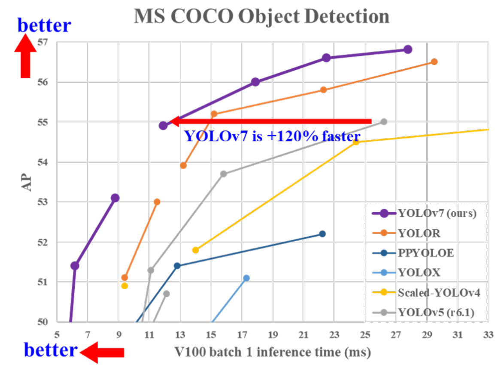
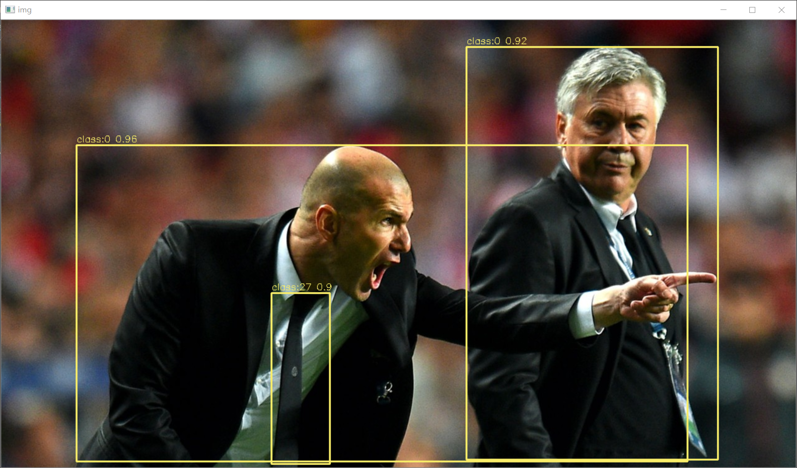

## B站教学视频

https://www.bilibili.com/video/BV1q34y1n7Bw/

## Introduction

**YOLOv7**是YOLOv4的原班人马(**Alexey Bochkovskiy**在内)创造的目标检测模型，在保证精度的同时大幅降低了参数量，本仓库实现**YOLOv7的tensorrt部署**。

<div align="center">

</div>

## Environment

- Tensorrt 8.5
- Cuda 11.6 Cudnn 8.4.1
- onnx 1.12.0
- onnx-simplifier 0.3.10
- Torch 1.7.1

## Benchmark

|    Model    | Size | mAP<sup>test</sup> 0.5:0.95 | GTX1650 FP16(ms) | GTX1650 FP32(ms) |
| :---------: | :--: | :-------------------------: | :--------------: | :--------------: |
| YOLOv7-tiny | 640  |            38.7             |       8.7        |       11.6       |
|   YOLOv7    | 640  |            51.4             |       27.2       |       47.5       |
|  YOLOv7-X   | 640  |            53.1             |       44.2       |       82.9       |

说明：此处FP16,fp32预测时间包含**preprocess+inference+nms**，测速方法为warmup10次，预测100次取平均值，并未使用trtexec测速，与官方测速不同；mAP<sup>val</sup>为原始模型精度，转换后精度未测试。

## Quick Start

下载**YOLOv7**仓库。

```
curl -s https://packagecloud.io/install/repositories/github/git-lfs/script.deb.sh | sudo bash
sudo apt install git-lfs
git clone https://github.com/DuaneNielsen/YOLOv7_Tensorrt.git
git clone https://github.com/WongKinYiu/yolov7
```

将本仓库的**EfficientNMS.py**和**export_onnx.py**复制到**yolov7**下，导出含有EfficientNMS的ONNX模型。

The --img-size parameter is the size the image will be changed to before being input into yolo,
it should match the size of the letterboxed images that was used in training.  Usually this will
be either 640 x 640 or 1280 x 1280

Also this code will do a couple other things...

1. it adds a pre-processing layer that will divide the input image by 255.
2. it makes use of the onnx non-max suppression layer.  So the network will output the final
detections directly.  No need to apply NMS to the output.

```
python export_onnx.py --weights ./weights/yolov7.pt  --img-size 640 640
```

将生成的**onnx**模型复制到**tensorrt/bin**文件夹下，使用官方**trtexec**转化添加完EfficientNMS的onnx模型。**FP32预测删除`--fp16`参数即可**。

```
trtexec --onnx=./yolov7.onnx --saveEngine=./yolov7_fp16.engine --fp16 --workspace=200
```

or (in case your trtexec is not working)

```commandline
python3 onnx_to_tensorrt.py yolov7-tiny-master.onnx yolov7-tiny-master.engine --img-size 640 640
```

等待生成序列化模型后，修改本仓库**infer.py模型路径和图片路径**。

```
trt_engine = TRT_engine("./trt_model/yolov7-tiny-master.engine", img_size=[640, 640])
img1 = cv2.imread("./pictures/zidane.jpg")
```

```
python infer.py ./yolov7-tiny-master.engine ./pictures/cone.png --img-size 640 640
```

Also, you can benchmark the network using test.py

```commandline
python3 test.py --data master.yaml --img-size 640 640 --conf 0.001 --iou 0.65 --device 0 --engine yolov7-tiny-master.engine --name test_tiny_master  --project runs/test
```

### full conversion on jetson xavier
```commandline
curl -s https://packagecloud.io/install/repositories/github/git-lfs/script.deb.sh | sudo bash && \
sudo apt install git-lfs
git clone https://github.com/DuaneNielsen/YOLOv7_Tensorrt.git
git clone https://github.com/DuaneNielsen/yolov7.git
cd YOLOv7_Tensorrt && \
pip3 install -e .
python3 export_onnx.py --weights engines/yolov7_tiny_master.pt --img-size 640 640
python3 onnx_to_tensorrt.py engines/yolov7_tiny_master.onnx engines/yolov7-tiny-master.engine --img-size 640 640
```

<div align="center">

</div>


## Reference

https://github.com/Monday-Leo/YOLOv7_Tensorrt

https://github.com/WongKinYiu/yolov7

https://github.com/ultralytics/yolov5

https://github.com/Linaom1214/tensorrt-python

https://github.com/triple-Mu
